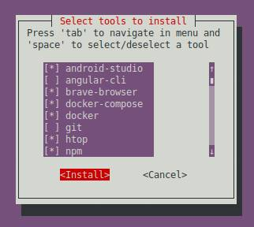

# dev_config

The purpose of this script is to configure the development environment with tools for web and mobile developers. If you, like me, have to format your computer and install it all over again, I hope this script helps. <br> <br>

## Installation

Clone the repository
```bash
git clone https://github.com/perotedev/dev_config.git
```

To start, enter in  repository root and type the follow command
```bash
./app.sh # this starts the script
```

Choose to install only tools that interest you <br>
 <br> <br>


## Available scripts for installation

***---\ Android Studio*** <br>
Android Studio is an integrated development environment to develop for the Android platform and provides the fastest tools for building apps on every type of Android device. <br>

***---\ Angular CLI*** <br>
The Angular CLI is a command-line interface tool that you use to initialize, develop, scaffold, and maintain Angular applications directly from a command shell.

***---\ Brave Browser*** <br>
Brave is a free and open source web browser developed by Brave Software Inc. The browser is currently the only one that adopts the pay-to-surf business model, blocking ads and website trackers.

***---\ Docker / Docker-Compose*** <br>
Docker is a set of platform-as-a-service products that use operating system-level virtualization to deliver software in packages called containers. Containers are isolated from each other and bundle their own software, libraries, and configuration files.

***---\ AnyDesk*** <br>
AnyDesk is a closed source remote desktop application distributed by AnyDesk Software GmbH. The proprietary software program provides platform independent remote access to personal computers and other devices running the host application. AnyDesk is frequently used by scammers. It offers remote control, file transfer, and VPN functionality. 

***---\ Git*** <br>
Git is a free and open source distributed version control system designed to handle everything from small to very large projects with speed and efficiency.

***---\ Htop*** <br>
Htop is an interactive process viewer and process manager. It is designed as an alternative to the top Unix program. It shows an up-to-date list of processes running on a computer, typically ordered by the amount of CPU usage.

***---\ NPM*** <br>
NPM (Node Package Manager) is a package manager for the JavaScript programming language maintained by npm, Inc. npm is the default package manager for the JavaScript runtime environment Node.js. It consists of a command line client, also called npm, and an online database of public and paid-for private packages, called the npm registry.

***---\ Postman*** <br>
Postman is an API platform for building and using APIs. Postman simplifies each step of the API lifecycle and streamlines collaboration so you can create better APIs—faster.

***---\ Scrcpy*** <br>
Scrcpy is a free and open-source screen mirroring application that allows control of an Android device from a Windows, macOS, or Linux desktop computer. The software is currently developed by Genymobile, which also developed Genymotion, an Android emulator.

***---\ Snapd*** <br>
Snap is a software packaging and deployment system developed by Canonical for operating systems that use the Linux kernel. The packages, called snaps, and the tool for using them, snapd, work across a range of Linux distributions and allow upstream software developers to distribute their applications directly to users.

***---\ Speedtest CLI*** <br>
The Speedtest CLI measure internet connection performance metrics like download, upload, latency and packet loss natively without relying on a web browser.

***---\ Vim*** <br>
Vim is a highly configurable text editor built to make creating and changing any kind of text very efficient. It is included as "vi" with most UNIX systems and with Apple OS X.

***---\ Visual Studio Code*** (*Includes 44 extensions*) <br>
Visual Studio Code is a code editor redefined and optimized for building and debugging modern web and cloud applications. The top pick for JavaScript and web developers, with extensions to support just about any programming language. 

***---\ ZSH*** <br>
Zsh is a shell designed for interactive use, although it is also a powerful scripting language. Many of the useful features of bash, ksh, and tcsh were incorporated into zsh; many original features were added.

